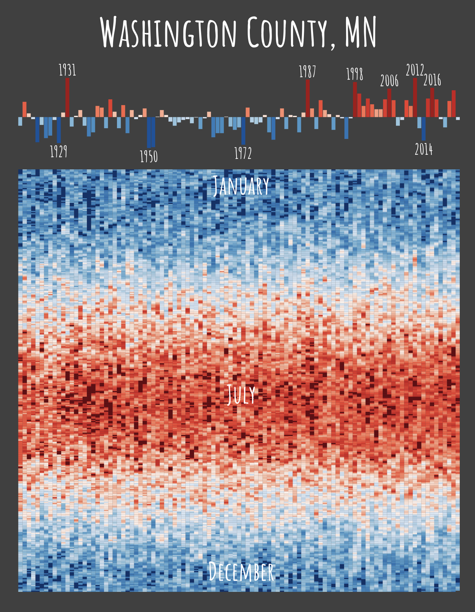

Tempestry aRt
================
26 April 2023

This script produces climate art! It is inspired by the [Tempestry
Project](https://www.tempestryproject.com/) and [warming
stripes](https://en.wikipedia.org/wiki/Warming_stripes).

It will help you make a poster showing about 100 years of temperature
data for various places. You’ll get the **annual trend** along with 365
days of **daily temperature** for each year! For some places, you can
also add other weather data (e.g. over a century of data on when Lake
Superior’s ice road to Madeline Island is open)! The data is roughly at
the county level, but modifications to different geographies should be
possible.

Since this is art:

1)  there are some small creative liberties taken (i.e., filling in of
    missing data, usage of different color breaks based on what looks
    good, using multiple NOAA weather stations which aren’t aligned with
    their dates of records, etc.),
2)  many details and data best practices are intentionally left out
    (i.e., you won’t find a figure legend here!),
3)  the code will need manual editing to get the aesthetics righ -
    what’s here should get you started, but you’ll probably need to do
    some polishing!

This ReadMe file explains the basic principles behind making a poster.
There are also a couple examples of posters I have given as gifts for
people, which may help you started too (in the Examples folder),

- WashingtonCo_MN: data from 1920 for the eastern Twin Cities. This is
  the geography for which this ReadMe was developed for, so the
  “defaults” are well suited for this area. The other scripts may give
  you a better idea of the little aesthetic tweaks to make.
- MadelineIsland_WI: a tempestry poster WITH over 100 years of ice
  phenology data! (from [Sharma et
  al. 2022](https://www.nature.com/articles/s41597-022-01391-6); so
  cool!)
- LakeGeneva_WI: another tempestry poster with ice phenology
- SanDiego_CA: this one makes some changes to stations included, since
  the weather varies so much based on distance from coast

<!-- -->

# Creating your poster

## Set-up

You will need to use an API key to connect to the NOAA database.
[Request an API key here](https://www.ncdc.noaa.gov/cdo-web/token), then
add the key to your `.Renviron` file. Enter in the console
`usethis::edit_r_environ()` and type
`NOAA_KEY="KEY GOES HERE, INSIDE QUOTES"`. Save and close the
`.Renviron` file, and restart R.

## Daily temperatures

### Fetch station data

The daily temperatures are fetched from stations within a certain
distance from a given latitude and longitude (i.e., your home or another
sentimental place). Sometimes the distance radius needs to be increased
if stations are sparse, and other times the specific latitude and
longitude might need to be adjusted to get what you want. Basically,
this is part of the art - figure out what looks good.

As an FYI, fetching station data does take a while. The very first time
this code is run, you’ll get stations names for all NOAA stations in the
US (that takes a while, but only needs to happen once). Whenever you
change the location for which you’d like to get data, it’ll also take a
while to run.

Sometimes the closest stations to the site need to be adjusted. A couple
tips: 1) The maximum number of stations to fetch data from is capped at
15. You may want to increase or decrease this number (edit the `limit`
call). 2) The stations can have different data availability, but
generally it seems like longer-term stations are more ideal for the art.
Still, you might need to adjust (edit the `year_min` and `year_max`
calls).  
3) The code will attempt to fetch data through the most recently
completed year, but you may need to write over your data cache to start
displaying the most up-to-date data.

### Decide what years to use

This is a balance! You probably want as many years of data as possible,
but some of the early records are spotty or missing. Some steps are
designed to deal with small missing data records, but you still need to
figure out a good starting year. The code below gets you to a good
estimate of what year to start at, but you may need to revisit it once
you see what the plots look like.

This `min_year` is a *global* parameter, which is passed to the
processing and plotting for both the daily and annual temperatures. So
if (when) this parameter is adjusted, all code chunks below this also
should be re-run (and subsequently styled). You’ll know an adjustment to
the `min_year` is needed if you see long “streaks” of the same daily
temperatures.

### Make daily plot

You will probably be reprocessing this piece several times to make it
look nice. The daily average temperatures get mapped (#aesthetics), so
just know that going into any manual adjustments you may be making.

Tips:

- Starting points for the temperature thresholds have been populated,
  but tweak as needed. Looking at the count of entries in each category
  can also be helpful (roughly even split between hot/cold, and even but
  less than !1000 in the extreme categories).
- You’ll probably end up trimming the dates included (i.e., starting the
  plots at a later date than the earliest potential date), which will
  mess with the starting point color scheme.
- Finally, you might have other aesthetic preferences! Establishing a
  consistent color scheme across multiple locations? Have a predefined
  parameter for extreme hot or cold temperatures?

## Annual average temperatures

### Fetch annual data

[Manually download county-level average
temperatures](https://www.ncei.noaa.gov/access/monitoring/climate-at-a-glance/county/time-series/MN-163/tavg/ann/2/1895-2023)
from NOAA. Annual averages are calculated using [some fancy
models](https://www.ncei.noaa.gov/access/monitoring/dyk/us-climate-divisions#grdd_)
which I am NOT going to attempt to re-create (weighting station data by
area, quality control algorithms, etc.). Save this file in the data-raw
folder.

### Plot annual data

The annual data is shown as deviations from the mean of all year’s
average temperature. Here too, the **years** which end up being included
matter. So if/when the `min_year` parameter is adjusted above, this
needs to get re-run.

The extreme years are labeled, but you may be adjusting the year
threshold. You also may be needing to remove labels and nudge them up or
down depending on what the data looks like.

## Combine poster elements

Once you make your poster art, I have had good luck [printing at
FedEx](https://www.office.fedex.com/default/posters.html). Cost of
\$17.25 for a poster print (matte paper, vertical orientation, size
16x20). But feel free to figure out what works for you (more convenient
location/store, maybe you have a bigger or smaller picture frame already
on hand that you’d like to use, maybe you want a fancier option like a
foam board backing, etc.).
